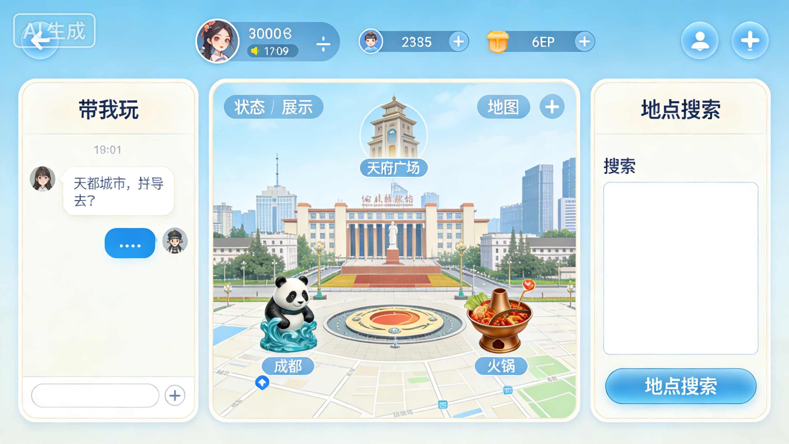

# 《带我玩》Web游戏

---

**灵感来源**

- QQ宠物的“主动式”交互体验
- 和朋友出去不知道去哪玩
- OpenClaw火出圈，虚拟人物对话

**游戏特点**

- 真实性：与现实世界1:1的时间流逝；真实城市地理数据；
- 灵活多变：Agent裁定用户从上号->对话->决策->反馈->评级全流程
- 资金限制：内置1000元，不可过度追逐高端奢侈，用完就没了
- 上下文记忆：更懂你的虚拟AI

**参考方案**

- 《捡爱》--游戏互动方式
- 《无尽的拉格朗日》--角色移动视图
- 《元神》--虚拟角色好感度、派蒙、子空间

---

## 游戏背景

虚拟人物**小爱**从外地刚刚来到成都，希望能够在成都过上充实、有意义的一天。

## 玩家任务

从个人生活经验出发，从小爱下车的**成都东**高铁站接她，作为本地导游带她游玩成都，应对意外情况，最大化小爱的情绪得分。

## 互动方式

1. 文本互动：通过对话框与小爱交流，确定下一步移动计划

> 待定功能备忘：
> 2. 小游戏特定环境互动：进入特定类型场所如餐馆、电影院、火锅店，触发特定小游戏
> 3. 意外事件第三方互动：如果中途发生意外事件如交通事故、受伤，触发与第三方人员交互如警察、医生

## 游戏评分参数

- 余额
- 游玩路线
- 小爱身体各项机能变化

## 游戏结束与结算条件

单局游戏在满足以下任一条件时结束，并进行最终评分结算：

- **时间耗尽**：游戏内时间到达晚上 22:00（结束充实的一天）。
- **资金耗尽**：内置的 1000 元余额花光（被迫提前结束行程）。
- **状态见底**：体力值降为 0 或心情值降为 0（小爱过于疲劳或因体验差而生气，提前离场，触发坏结局）。

## 数据需求

- 地图图片
- 地铁线路及站点
- 道路
- POI表

---

# 系统详细架构

## 前端功能要点

### 1. 对话功能

- 消息收发
- 历史消息浏览

### 2. 状态展示

- 余额
- 当前时刻
- 当前位置
- 历史决策

### 3. 地图

- 展示当前位置
- 始末路线
- 搜索地点展示

### 4. 地点搜索框

- 地点列表
- 地点信息

### 6. 示例UI展示

## 后端功能要点

### 1. 智能体

**属性**

- 角色定义
- 输出规范
- 工具列表
- 独立上下文

**方法**

- 发送消息并等待结果
- 根据用户的输入进行意图识别工具调用（Function Calling机制）：自主调用相应的内置函数如 `update_status`、`search_poi`，并将工具执行结果添加进上下文。

### 2. 状态管理

**属性**

- 余额
- 当前时刻
- 当前位置
- 当前参数：体力值、饱食度、心情值

**方法**

- 任一属性的增删查改

### 3. 地图管理

**属性**

- 当前展示的地图图片（静态图片）

**方法**

- 地图图片生成
- 连接数据库
- 路线规划
- 依据关键词搜索地点

### 4. 搜索框

**属性**

- 搜索文本
- 地点卡片及内容

**方法**

- 根据搜索文本搜集信息，并更新卡片

### 5. 战绩管理

**方法**

- 依据条件筛选历史游玩数据

### 6. 决策管理

**属性**

- 4大基类：聊天/移动/休息/娱乐/

**方法**

- 更新状态参数

## 数据库存储

### 1. 战绩存储数据库

- 单局游戏UID
- 游玩开始时刻（真实时间）
- 游玩结束时刻（真实时间）
- 游玩路线
- 剩余余额
- 小爱情绪变化
- 游戏最终评分

### 2. 成都POI点数据

- 点位UID
- 点名称
- 归属类型
- 经度
- 维度
- 营业时间
  （能找到什么样的数据就用什么样的特征）

### 3. 对话历史表

- 单局游戏UID
- 消息列表：list[json]
  - 发送人（小爱/用户/系统）
  - 内容
  - 时刻

### 4. 智能体定义

- 角色ID
- 角色定义
- 输出规范
- 工具列表

## 处理逻辑

### 1. 文本互动

用户发送消息
    ⇓
小爱回复消息
    ⇓
系统（Agent）判断归属哪一类事件？
  - 聊天
    - 返回消息
    - 更新状态：心情值
  - 移动
    - 触发决策
    - 返回消息
    - 更新状态：余额、时刻、位置、体力值
  - 休息
    - 返回消息
    - 更新状态：时刻、体力值
  - 娱乐
    - 触发决策
    - 返回消息
    - 更新状态：余额、时刻、体力值、心情值

### 2. 搜索框

搜索框不搜东西的时候

- 展示当前位置附近的POI及其信息

输入搜索内容

- 展示搜索结果的POI及其信息

POI列表可进行的操作：
    - 详情
        - 展示当前POI的详细信息
    - 导航
        - 选择移动方式：步行/地铁/打车
        - 刷新地图视图为导航路线
        - 展示估计更新的状态：余额、体力值、心情值、时间

### 3. 地图

位置更新 or 导航时

- 刷新地图图片
